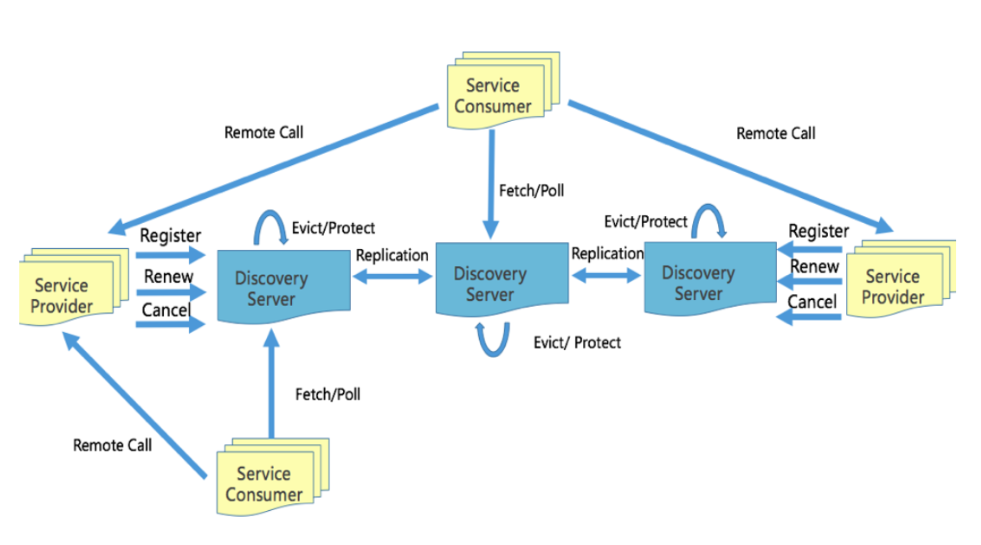

# go-common/app/infra/discovery

## 项目简介
> 1. 服务注册发现
> 2. AP系统,不依赖任何组件或中间价，保证高可用

## 核心逻辑


1、service 向discovery 服务注册 appid
2、client 通过 appid 从discovery 查询 service 的addr
3. 还包括polls长轮循infra.discovery服务自发现、负载均衡等


## 路由信息
* register 服务注册
* fetch 获取实例
* fetchs 批量获取实例
* polls 批量获取实例
* renew 心跳
* cancel 下线
* nodes 批量获取节点

## 实例
### 服务注册
服务注册逻辑register -> renew ->cancel 注册 然后 不停给心跳 最后取消注册
1、启动dicovery服务
2、服务初始化
3、polls 长轮循 infra.discovery 服务自发现, 如果server节点实例没有变更，则接口会阻塞直到30s返回-304。(poll(polls) 接口为长轮训接口
4、新的连接 & 服务注册、这时候我们起动的demo.server服务注册上来了
5、polls 长轮循 infra.discovery 服务自发现
6、renew心跳
7、最后我杀掉了注册的服务，出现了cancel请求
```go

	ip := "127.0.0.1"
	port := "9000"
	hn, _ := os.Hostname()
	dis := discovery.New(nil)
	ins := &naming.Instance{
		Zone:     env.Zone,
		Env:      env.DeployEnv,
		AppID:    "demo.service",
		Hostname: hn,
		Addrs: []string{
			"grpc://" + ip + ":" + port,
		},
	}

	cancel, err := dis.Register(context.Background(), ins)
	if err != nil {
		panic(err)
	}

	defer cancel()
```

### 服务发现
```shell
# 配置discovert节点 
set DISCOVERY_NODES=127.0.0.1:7171
```

```go
package dao

import (
	"context"

	"github.com/bilibili/kratos/pkg/naming/discovery"
	"github.com/bilibili/kratos/pkg/net/rpc/warden"
	"github.com/bilibili/kratos/pkg/net/rpc/warden/resolver"

	"google.golang.org/grpc"
)

// AppID your appid, ensure unique.
const AppID = "demo.service" // NOTE: example

func init(){
	// NOTE: 注意这段代码，表示要使用discovery进行服务发现
	// NOTE: 还需注意的是，resolver.Register是全局生效的，所以建议该代码放在进程初始化的时候执行
	// NOTE: ！！！切记不要在一个进程内进行多个不同中间件的Register！！！
	// NOTE: 在启动应用时，可以通过flag(-discovery.nodes) 或者 环境配置(DISCOVERY_NODES)指定discovery节点
	resolver.Register(discovery.Builder())
}

// NewClient new member grpc client
func NewClient(cfg *warden.ClientConfig, opts ...grpc.DialOption) (DemoClient, error) {
	client := warden.NewClient(cfg, opts...)
	conn, err := client.Dial(context.Background(), "discovery://default/"+AppID)
	if err != nil {
		return nil, err
	}
	// 注意替换这里：
	// NewDemoClient方法是在"api"目录下代码生成的
	// 对应proto文件内自定义的service名字，请使用正确方法名替换
	return NewDemoClient(conn), nil
}

// 嵌入dao结构, 注册请求接口
// dao dao.
type dao struct {
	db          *sql.DB
	redis       *redis.Redis
	mc          *memcache.Memcache
	demoClient  demoapi.DemoClient
	cache *fanout.Fanout
	demoExpire int32
}

// New new a dao and return.
func New(r *redis.Redis, mc *memcache.Memcache, db *sql.DB) (d Dao, err error) {
	var cfg struct{
		DemoExpire xtime.Duration
	}
	if err = paladin.Get("application.toml").UnmarshalTOML(&cfg); err != nil {
		return
	}
	
	grpccfg := &warden.ClientConfig{
		Dial:              xtime.Duration(time.Second * 10),
		Timeout:           xtime.Duration(time.Millisecond * 250),
		Subset:            50,
		KeepAliveInterval: xtime.Duration(time.Second * 60),
		KeepAliveTimeout:  xtime.Duration(time.Second * 20),
	}
	//paladin.Get("grpc.toml").UnmarshalTOML(grpccfg)
	var grpcClient demoapi.DemoClient
	grpcClient, err = NewClient(grpccfg)

	d = &dao{
		db: db,
		redis: r,
		mc: mc,
		demoClient : grpcClient,
		cache: fanout.New("cache"),
		demoExpire: int32(time.Duration(cfg.DemoExpire) / time.Second),
	}
	return
}

```

